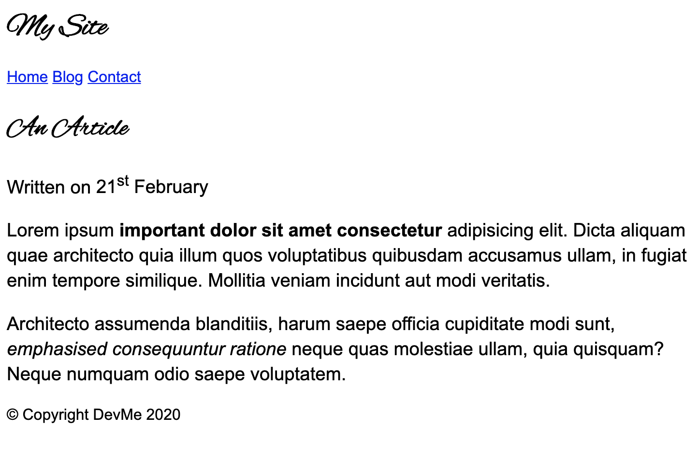
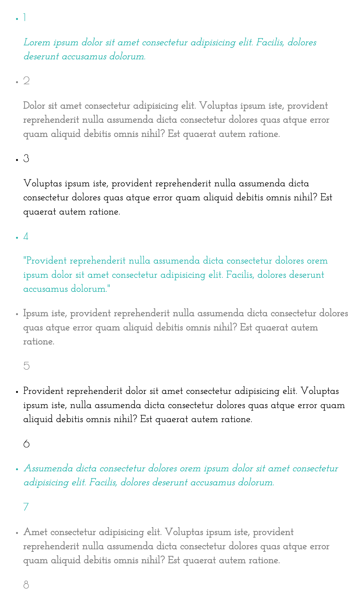

# Web Fonts

### Exercise 1

Create a CSS file and link it to your article HTML page.

Change the `font-family` on the body of your previously made article HTML page, to a widely used system font and a backup `sans-serif`

Change the font size and line height of the article text.

### Exercise 2

Include a web font into your article HTML page. Update your CSS to show the new font you have included for the headings on the page.

### Exercise 3

Style the number list HTML file from earlier with custom fonts, like the image below:

(I used Poiret for the numbers and Josefin Slab for the text, but feel free to use any fonts you fancy)

