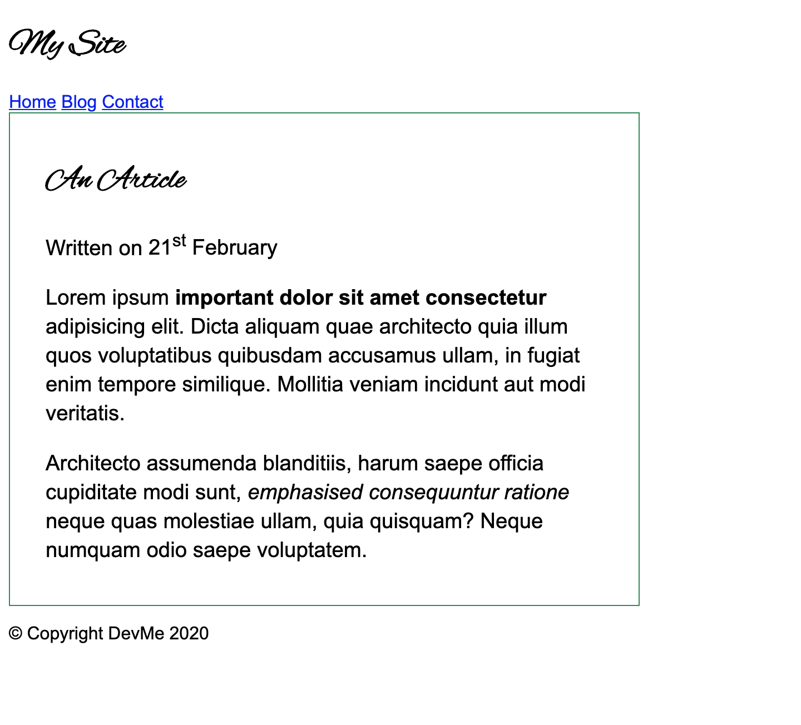
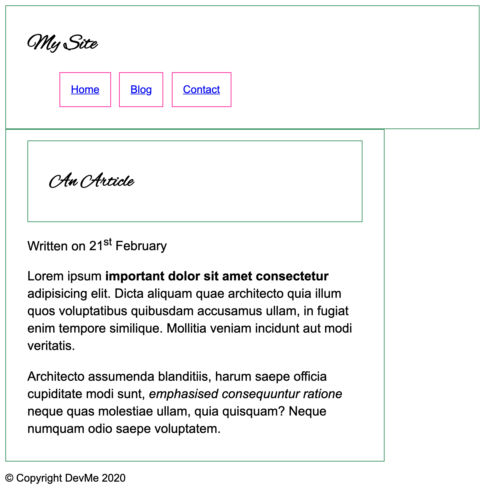

# Box Model

### Exercise 1

Take the article HTML page and add a width and padding to the article

Make sure the padding is included in the width

You might find it helpful to add a temporary border to the element you are laying out to see where it is

### Exercise 2

Do the same for the header but omit the width

Turn the navigational links into a list. Get the nav links to sit next to each other and look like boxes as in the image... using what you have learnt already

### Exercise 3

Make sure your entire page doesn't get wider than 900px and stays in the center when it reaches it's maximum width

Hint: The best way to do this is to add an element

### Exercise 4

Add a button to the bottom of your article. Use everything you have leant to make it look like this image: