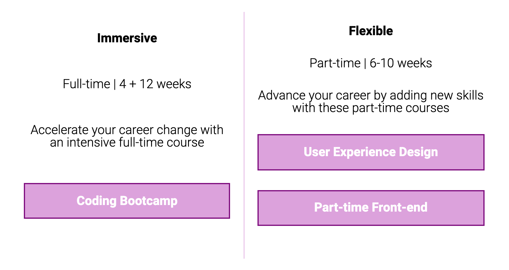

# Flexbox

### Exercise 1

Practise your flexbox! [Fork this codepen](https://codepen.io/devmeexamples/pen/PoZWKLO) and use flexbox to make it look like the below image.

Hint: You need to use flexbox on more than one element

[Answer](https://codepen.io/devmeexamples/pen/NWxdvZB)

### Exercise 2

Go back to your article HTML page and get the nav and heading inline within the header using flexbox.

Add some space inside the footer, then use flexbox to center the paragraph.

Is there anywhere else on this page you think flexbox would be more suitable than something we have used before?

### Exercise 3

Practise your flexbox! [Fork this codepen](https://codepen.io/devmeexamples/pen/zYrNdbO) and use flexbox to make it look like the below image.

[Answer](https://codepen.io/devmeexamples/pen/GRorvev)