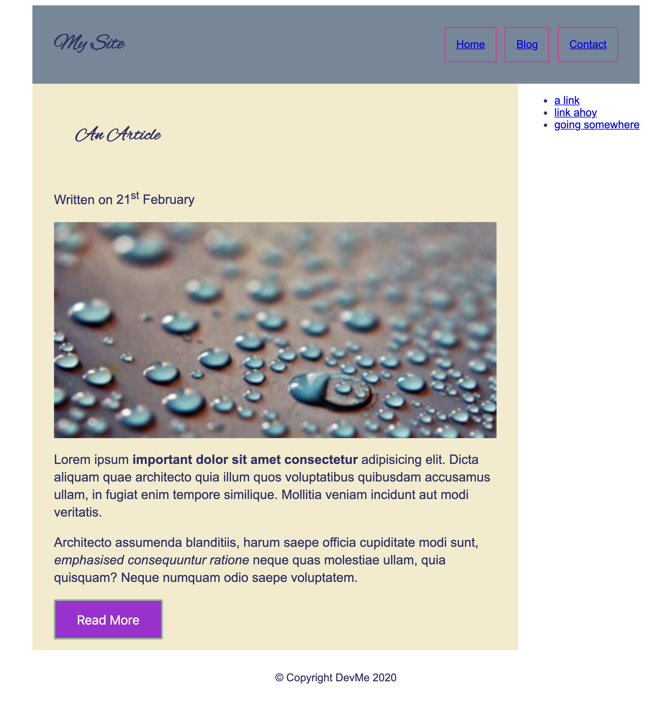

# Responsive Design & Media Queries

### Exercise 1

Back in your article HTML page use media queries to change the background colour of the header when the site get's larger than 600px

### Exercise 2

Use media queries to make the sidebar disappear and the article become full width when the site gets smaller than 600px

### Exercise 3

Remove the float from the article image and have it display full width of the article, before the paragraphs.

Make the image respond when you resize the browser, but stay filling the container.

Hint: It's ok to use a height here

Swap out the image for a big version when the screen gets larger than 600px

What do you notice about the order in which you are writing your CSS?
