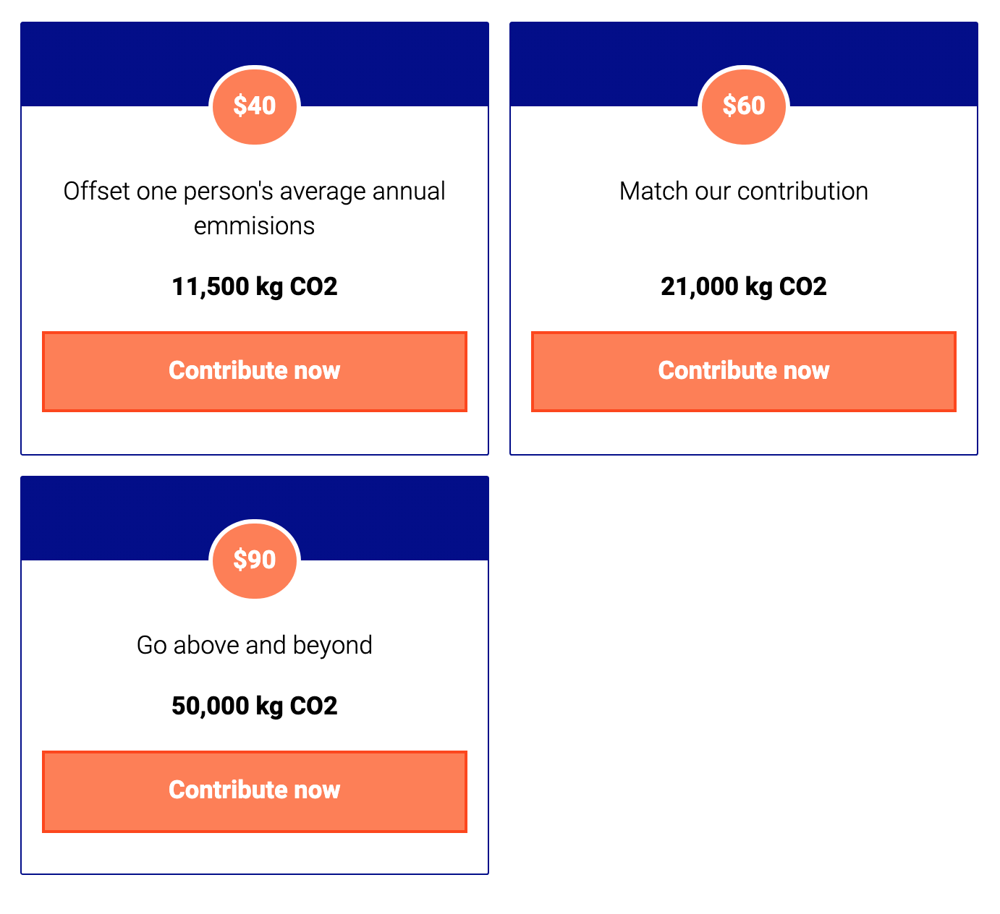
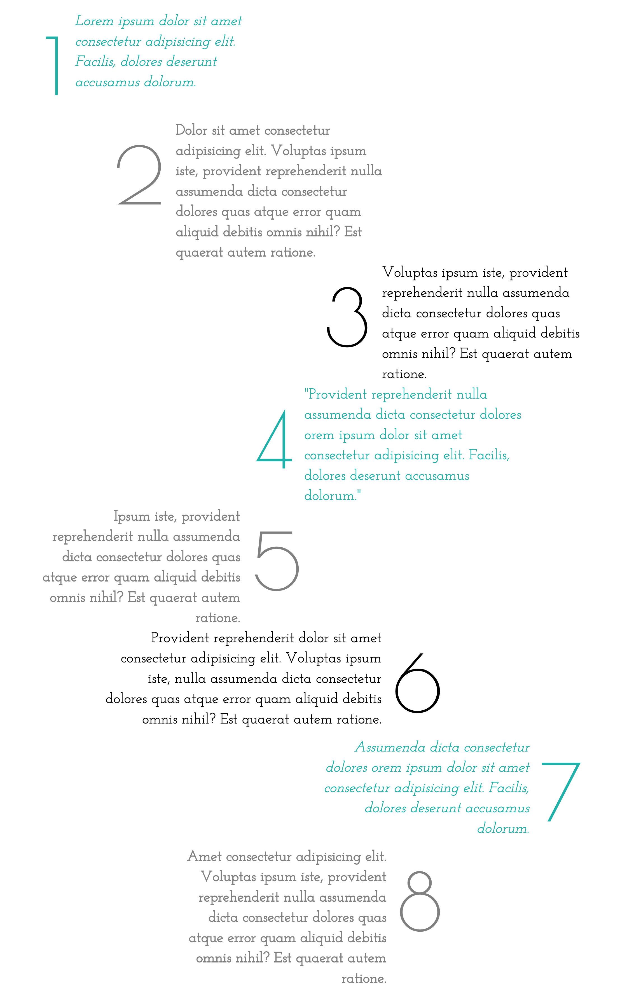

# Grid Part 2

### Exercise 1

[Fork this codepen](https://codepen.io/devmeexamples/pen/QWyMEmo)

By only declaring columns, get the cards to sit in a 2 by 2 grid as per the image below.

See what happens if you add another card to the HTML.

[Answer](https://codepen.io/devmeexamples/pen/dyGNzQX)

### Exercise 2

[Fork this codepen](https://codepen.io/devmeexamples/pen/rNxjzZg)

Create the grid for the design below. Use line numbers and the span keyword to position the images.

[Answer](https://codepen.io/devmeexamples/pen/pogRrxQ)

### Exercise 3

Go back to the numbered list HTML page and replicate the design below using CSS Grid.

### Exercise 4 (extension)

Recreate the designs found in the mini-project folder with both Grid and Flexbox.
