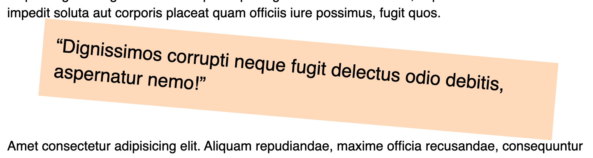

# Positioning & Transforms

### Exercise 1

[Fork this codepen](https://codepen.io/Rumyra/pen/827586ad0f716769f39bba9d260248c7) and make the header stay at the top of the page on scroll.

### Exercise 2

In the same codepen, make the x button appear at the top right of it's section

### Exercise 3

In the same codepen, rotate the quote.

[Answer](https://codepen.io/Rumyra/pen/ExjmdGm)