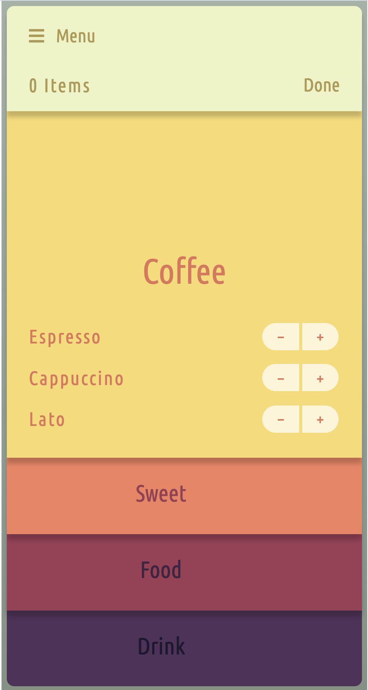
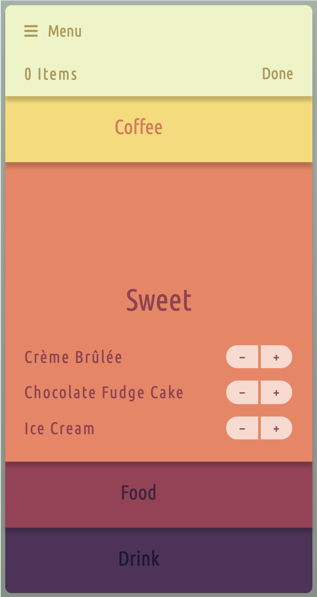

# Have you finished?

Brilliant! Check in with your tutor to see what you want to do next and make sure you have done a code review.

Once you've implemented any feedback you have a choice of what you can do next:

## Choose your own adventure

### Option One
#### Learn Sass

We haven't covered SASS in the past two weeks, you will come across it later in the course when you undergo the tooling week. However if you want to get a head start [read the information on this page](https://sass-lang.com/guide).

To have a go at using SASS [Codepen](https://codepen.io/) is a great option as you can get your pen to allow for Sass instead of CSS. Just go to the drop down arrow next to the CSS pane and choose SCSS. Now you can start writing Sass!

If you are stuck for what to practise [check out this collection here](https://codepen.io/collection/DQZBvq) for some fun things (you can find CSS only pens), or go to Option Two, where you can use Sass for that task.

### Option Two
#### Personal Project

You should have already received the brief for your own personal site and started to think about content. Feel free to begin the page itself. The brief can be found on BaseCamp.

Again if you want to use Sass for this project, try starting it in Codepen, you can always export your code later once you decide on the tool you want to use for the site.

>Codepen projects are also a good option for beginning this task. If you save a file with a .scss extension it will automatically be a sass file \o/

### Option Three
#### Keep practising

If neither of these options float your boat, why not keep practising what you've learnt with the below designs.

This is a one page app with expanding sections. You'll need to find a way to get the sections to open and close smoothly.

If you want to start to think about javascript ready for next week try to include the functionality of the plus and minus buttons updating the _Items_ at the top.

