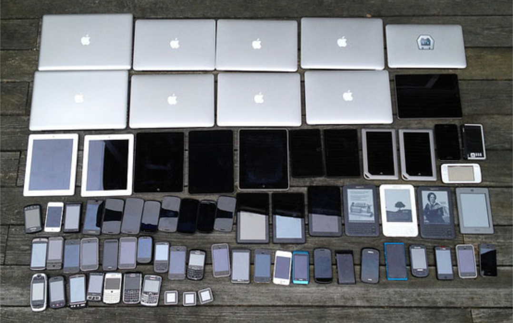

# Responsive & adaptive design

- Vast majority of websites are accessed by different devices rather than just a desktop these days
- How do we deal with this?

---



---

## Responsive

Responding to the environment

Making the webpage/app resize to it's device for instance

---

## Adaptive

Adapting to the device

Serving a different set of files for different set of devices or connections

I'm sure you seen 'mobile' sites - this is adaptive. We'll be looking into responsive on this course as it's uses a specific coding technique

---

### Designs that work in all environments:

- Screens
- Inside/outside
- Noisy/quiet
- Fibre/2G

---

- Demonstrate [Guardian](https://theguardian.com/uk)

---


### How?

- Use relative not absolute CSS units
- CSS Media Queries

#### There are other methods
- Is also JavaScript feature and device detection
    - https://modernizr.com/

Quickly demonstrate the tools available using the below code. The idea here is to start with images spilling outside of their container and then use relative units to fix that and then a media query to change the image size at different screen sizes.

```html
 <section class="flex-container">
    <figure class="img-container">
      
    </figure>
    <figure class="img-container">
      
    </figure>
    <figure class="img-container">
      
    </figure>
  </section>
```

Starting CSS
```css
html {
	font-size: 16px;
	line-height: 1.4;
	color: #333;
}

figure {
	margin: 0;
}

.img-container {
	border: 2px solid red;
	padding: 1rem;
	width: 10%;
}
```

Ending CSS

```css
.img-container img {
	width: 100%;
}

@media screen and (min-width: 768px) {
	.img-container {
		width: 25%;
	}
}
```

---

### Media queries

Different types of media, like print

```css
@media print {

    * {
        background-color: transparent;
    }

}
```
---

### Breakpoints (viewport width)

```css
/* phone */
@media screen and (max-width: 500px) {

    #left-column {
        display: none;
    }

}
```

---

```css
/* Extra small devices (phones, less than 768px) */
@media screen and (max-width: 767px) { ... }

/* Small devices (tablets, 768px and up) */
@media screen and (min-width: 768px) and (max-width: 991px) { ... }

/* Medium devices (desktops, 992px and up) */
@media screen and (min-width: 992px) and (max-width: 1199px) { ... }

/* Large devices (large desktops, 1200px and up) */
@media screen and (min-width: 1200px) { ... }
```
---

### How do I see it?

You can move the screen width when devtools is open. There is also a mobile/tablet icon at the top, if you select this you can choose a number of screen sizes.

---

### Media

There's no point loading large images for small screens. Also how do you keep the aspect ratio you want and not the images?

---

#### Loading different pictures

You can use the `picture` element to load different image types and also different files based on screen size

```html
<picture>
    <source srcset="surfer.png" media="(min-width: 800px)">
    
</picture>
```

---

#### Object fit

You can use the `object-fit` property to display how the image appears in it's container.

```css
img {
    height: 100%; width: 100%;
    display: block;
    object-fit: contain;
}
```
