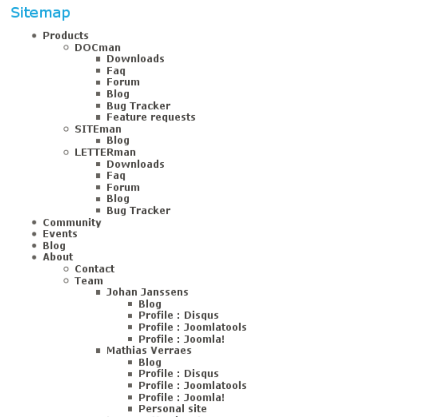

# Sitemapping
---

- Site maps used during the planning of a Web site by its designers.
- Human-visible listings, typically hierarchical, of the pages on a site.
also
- Structured listings intended for web crawlers such as search engines.

_cite wikipedia_

We're not talking about the last one here

---

### Articulates page structure of a website

Think about:

- Hierarchy of content
- Sections and pages
- User journeys

---

### Simply a list

---

### Or a flow diagram

---
#### Exercise:

### Make a sitemap

[https://www.gloomaps.com/](https://www.gloomaps.com/)

[https://bubbl.us/](https://bubbl.us/)

---

When they have done the exercise show this image

---
