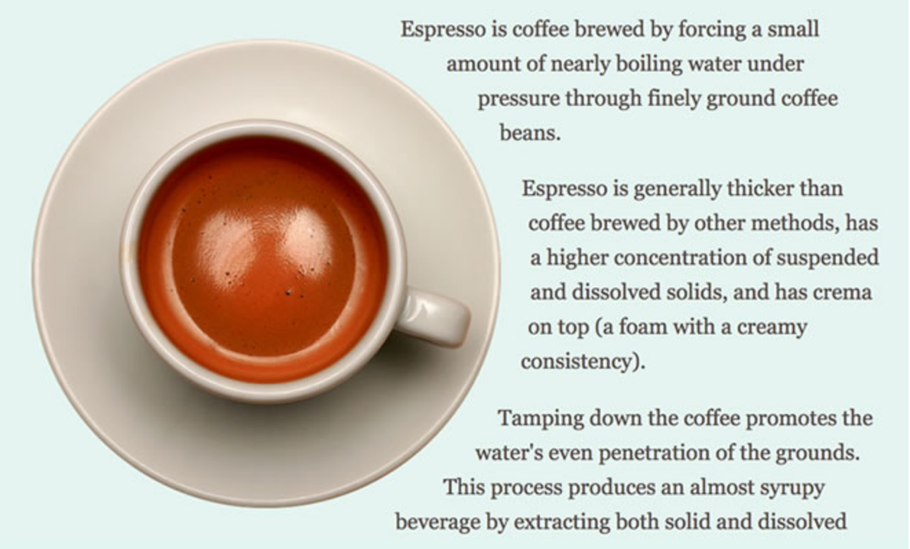

# CSS Effects

---

### CSS can do some pretty cool things

- Gradients
- Filters
- Blend modes
- Image masking
- Shapes

---

#### Gradients

Linear, radial or conic functions


```css
article {
    background-image: linear-gradient(90deg, red, blue);
}
```


---

Use with multiple background images & background size to create cool patterns [https://leaverou.github.io/css3patterns/](https://leaverou.github.io/css3patterns/)


---

#### Filters

Media (images & video)


```css
/* can be blur, brightness, contrast, drop-shadow, grayscale, hue-rotate, invert, opacity, saturate, sepia */
img {
    filter: saturate(50%) hue-rotate(30deg);
}
```


---

#### Blend modes

See through (blend) elements


```css
/* difference between element & background */
article {
    mix-blend-mode: soft-light;
}
p {
    background-color: purple;
    background-image: url(image.jpg);
    background-blend-mode: multiply;
}
```


---

### CSS Shapes



---

#### Shapes


```css
img {
  float: left;
  shape-outside: circle(50%);
}
```


---

### Masks

[Mask example on codepen](https://codepen.io/devmeexamples/pen/gOwBEXo)

---

#### Masks

Gradients/images create mask of an element


```css
section {
  mask-image: linear-gradient(90deg, black, transparent 90%);
}
```


---
