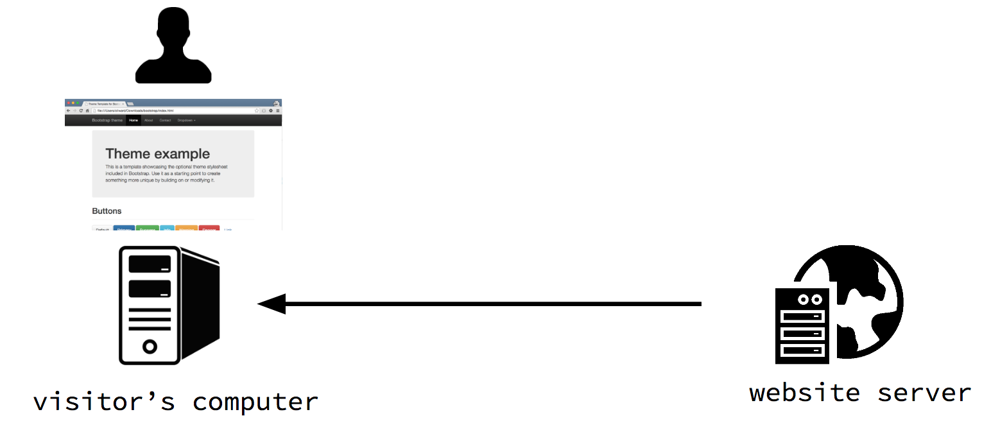
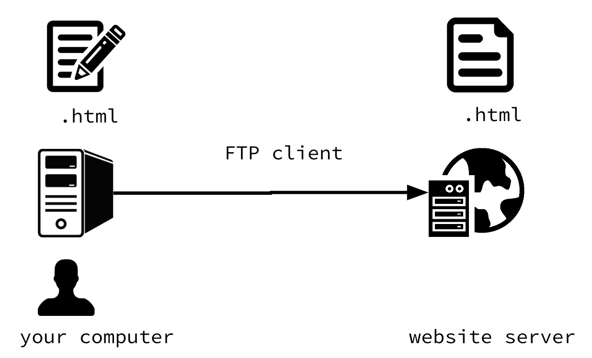
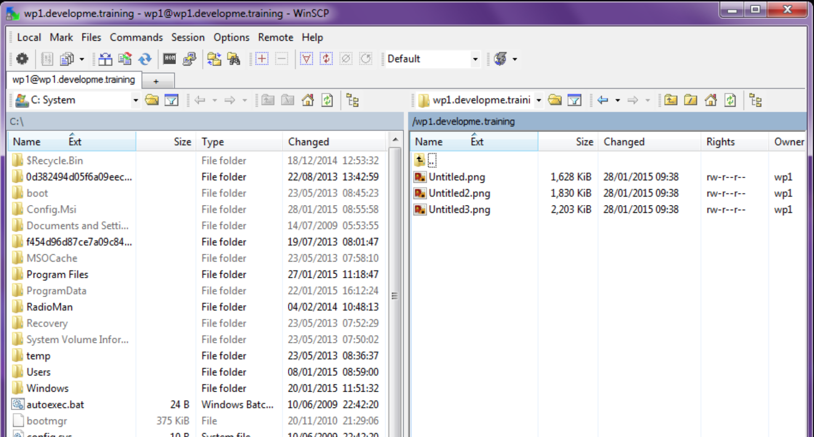

# Publishing your website

So what you've built is all well and good, but at the moment only you can see your website, as it only exists on your computer.

Sure you could hand your computer round to anyone who you wanted to view your website, or ZIP and email a copy, but that’s probably not the best information distribution mechanism.

---

### server-client architecture

So what you want is when someone is on their computer, using their browser, and they go to your website, that they can then view your website.

And this is where a server comes in.

---

### Hosting

So there are loads of services that will host your website for you.

---

### Uploading to a server

Once you’ve got a web host you’ll want to get your site on your server, from your computer.

And that’s where an FTP client comes in.

FTP = File Transfer Protocol

---

### FTP Client

And this is what an FTP client looks like, once you’ve put in your server details and connected.

---

### Domain Name System (DNS)

So, you’ve got your files on your server, great.

Next step is that you want for people to be able to see your website, so you’ll want a domain name.

It’s at this point that its worth looking at how domains and the domain name system works.

---

### Setting up a domain

- Buy (rent) a domain (URL)
- ‘Point’ the domain at your hosting/server IP
- Let the domain update ‘propagate’

Domain and hosting are different things. Domain is the url/address. Hosting is the place you put the files. You need to link these two.

A domain often comes with your hosting, or you can usually rent a domain from the same place you get your hosting

---

### Exercise: Get your website online

---

- Get a domain - done for you ✅
- Get hosting - done for you ✅
- Point domain at hosting - done for you ✅
- Upload your files

---

### Please only do this one at a time!!

---

### Use your FTP client to connect and upload

host: developme.space

user: *name*

password: *emailed to you*

---

### Visit your website

Use your browser to visit your website

website address:

`name.developme.training`